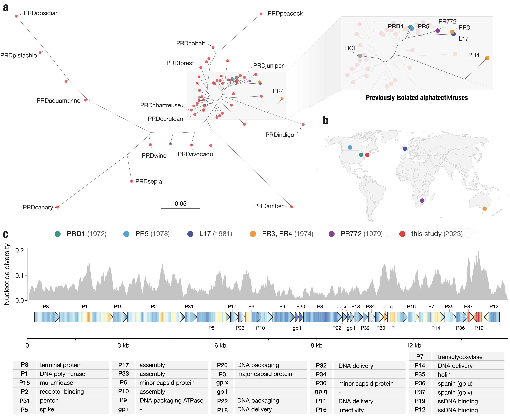
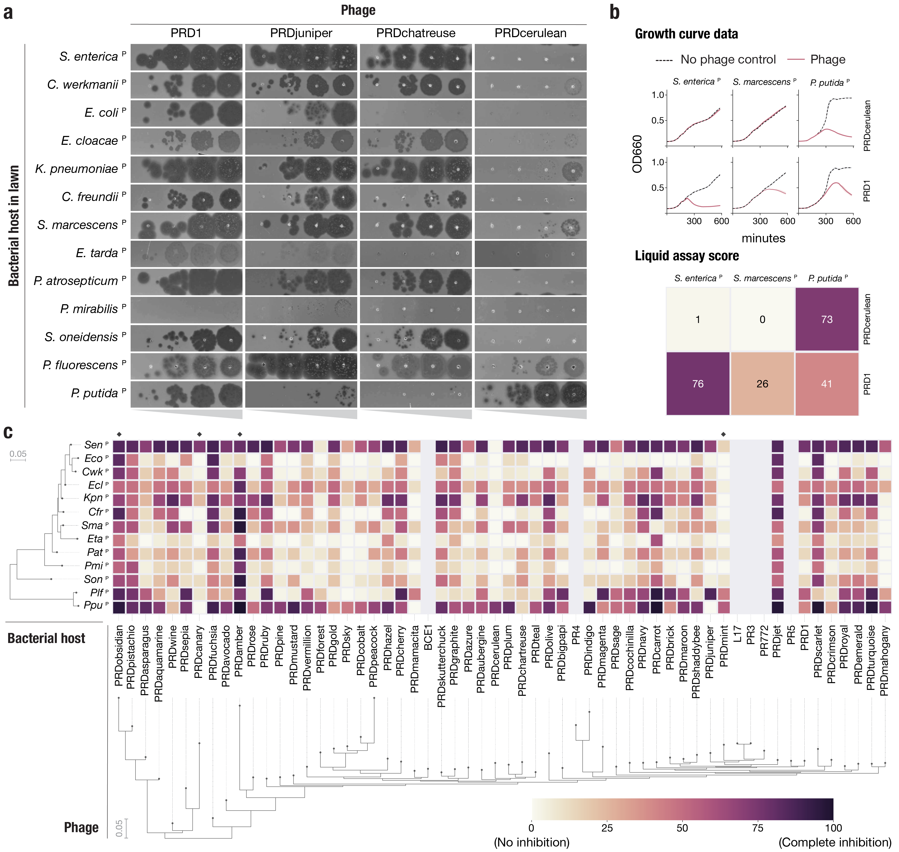
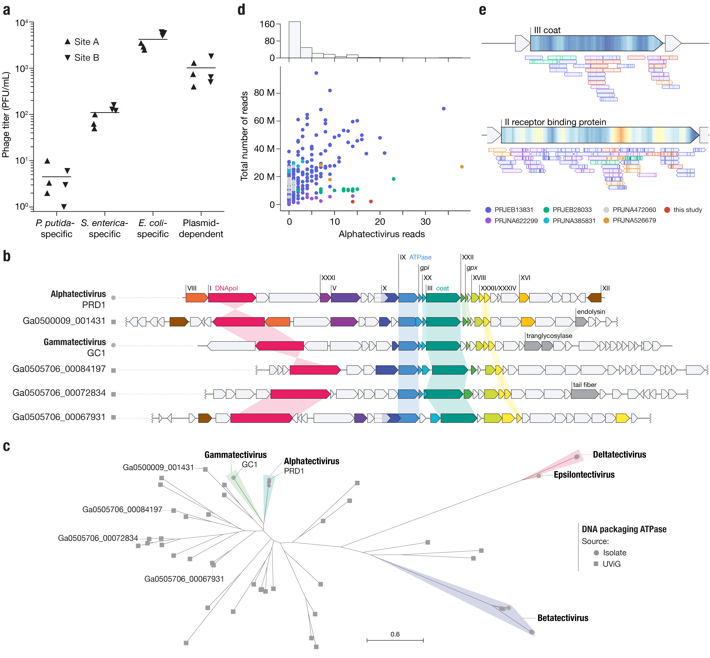
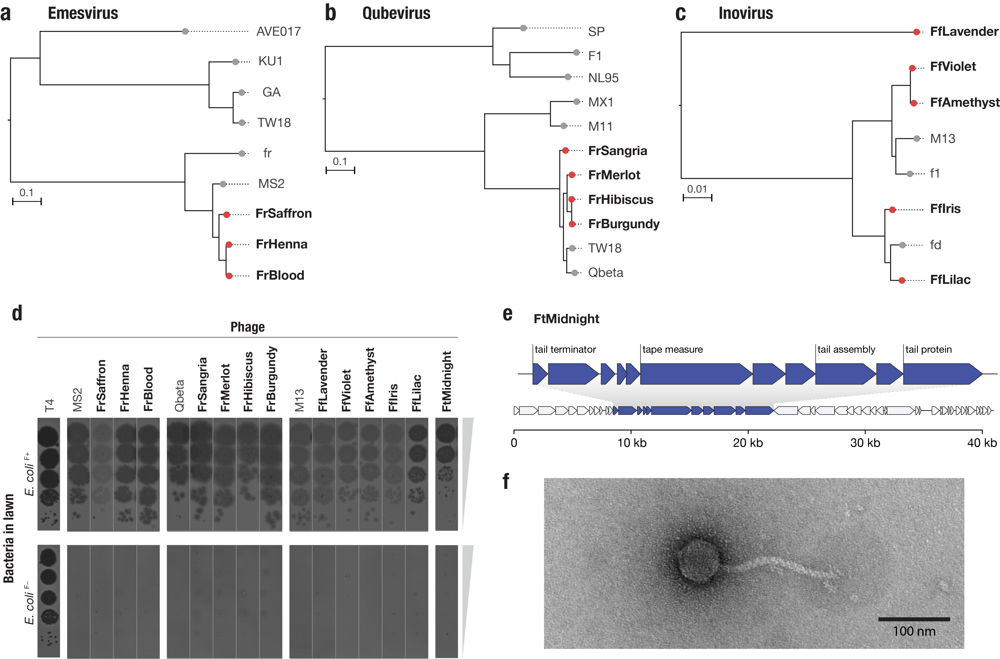

# 2023_QuinonesOlvera-Owen

## About
Code corresponing to the paper:

> [**Diverse and abundant viruses exploit conjugative plasmids** (2023)](https://doi.org/10.1101/2023.03.19.532758)
>
> [bioRxiv]
>
> Natalia Quinones-Olvera*, Siân V. Owen*, Lucy M. McCully, Maximillian G. Marin, Eleanor A. Rand, Alice C. Fan, Oluremi J. Martins Dosumu, Kay Paul, Cleotilde E. Sanchez Castaño, Rachel Petherbridge, Jillian S. Paull, Michael Baym

## Table of Contents
- [Genomes](#genomes)
- [Figure 1](#figure-1)
- [Figure 2](#figure-2)
- [Figure 3](#figure-3)
- [Figure 4](#figure-4)
- [Figure 5](#figure-5)

- [How to reproduce this]()

---

# Genomes
- **Code**
    - [Snakemake](genomes/scripts/Snakefile) pipeline for genome assembly and annotation
- **Data**
    - SRA BioProject: [`PRJNA954020`](https://www.ncbi.nlm.nih.gov/bioproject/PRJNA954020)
        - Sequencing runs: `SRR24145707` - `SRR24145772`
    - Metadata [`phage_metadata.tsv`](genomes/data/metadata/phage_metadata.tsv)
    - Assemblies [`genomes/data/assemblies_oriented`](genomes/data/assemblies_oriented/)
    - Genbank annotations [`genomes/data/annotation/_gbks/`](genomes/data/annotation/_gbks)

---

## Figure 1


### 1a, 1c: Phage DisCo
- **Code**
    - Jupyter notebook with image processing: [`Fig1.ipynb`](figures/Fig1/Fig1.ipynb)
- **Data**
    - Image files: [`Fig1/data`](figures/Fig1/data)

## Figure 2



### 2a: Tree
- **Code**
    - [Jupyter notebook](figures/Fig2/large_tree/large_tree.ipynb): Whole genome alignment and tree building
        - Key commands:
        ``` bash
        # whole genome alignment
        clustalo -i <alphatv.fasta> -o <alphatv.msa.fasta> --outfmt=fa
        
        # tree building
        iqtree -st DNA -m MFP -bb 1000 -alrt 1000 -s <alphatv.msa.trim.fasta>
        ```
- **Data**
    - Genomes used (unaligned `fasta`): [`alphatv.fasta`](figures/Fig2/large_tree/data/alphatv.fasta)
    - Whole-genome alignment (trimmed aligned `fasta`): [`alphatv.msa.trim.fasta`](figures/Fig2/large_tree/data/alphatv.msa.trim.fasta)
    - Newick tree file (`iqtree` output): [`alphatv.msa.trim.fasta.treefile`](figures/Fig2/large_tree/data/iqtree/alphatv.msa.trim.fasta.treefile)

### 2b: Map
- **Code**
    - [Jupyter notebook](figures/Fig2/map/map.ipynb): Map figure
- **Data**
    - Coordinates and references for map: [`coordinates.tsv`](figures/Fig2/map/data/coordinates.tsv)

### 2c: Nucleotide diversity
- **Code**
    - [Snakemake](figures/Fig2/nucleotide_diversity/figure_ndiv.smk):  Pipeline producing the alignments and nucleotide diversity calculation.
         - Key commands:
        ``` bash
        # align each assembly to reference
        minimap2 -ax asm20 -B2 -O6,26 --end-bonus 100 --cs <NC_001421.fasta> <assembly> > <output.sam>
        
        # calculate nucleotide diversity
        vcftools --vcf <merged_vcf> --window-pi 100 --window-pi-step 1 --out <NucDiv.100bp.slideby1.windowed.pi>
        ```
    - [Jupyer notebook](figures/Fig2/nucleotide_diversity/notebooks/nucleotide_diversity.ipynb): Plot, heatmap, and genome map.
- **Data**
    - Nucleotide diversity values for sliding window size 100 bp: [`NucDiv.100bp.slideby1.windowed.pi`](figures/Fig2/nucleotide_diversity/data/NucDiv/NucDiv.100bp.slideby1.windowed.pi) 
    - PRD1 reference annotation (curated version of [`NC_001421`](https://www.ncbi.nlm.nih.gov/nuccore/NC_001421)): [`PRD1_updated.gb`](genomes/data/reference/genomes/PRD1_updated.gb)
    - Assemblies: [`genomes/data/assemblies_oriented`](genomes/data/assemblies_oriented)

## Figure 3



### 3b,c: Host-range heatmap
- **Code**
    - [Jupyter notebook](figures/Fig3/notebooks/heatmap.ipynb): Processing growth curves, calculating area under the curve and liquid assay score, producing heatmap.
    - [Jupyter notebook](figures/Fig3/notebooks/concept_curves.ipynb): Plotting sample curves and heatmap.
    - Custom functions imported in notebooks: [`EOL_tools.py`](figures/Fig3/scripts/EOL_tools.py)
        - Area under the curve calculation ([line](https://github.com/baymlab/2023_QuinonesOlvera-Owen/blob/2b4ffa50c19ad3a0ebc7ec0775f96a7447d78a8c/figures/Fig3/scripts/EOL_tools.py#L89)): $auc = \sum_{i=1}^{120}\frac{OD_{i+1} + OD_{i}}{2}$
        - Liquid assay score calculation ([line](https://github.com/baymlab/2023_QuinonesOlvera-Owen/blob/2b4ffa50c19ad3a0ebc7ec0775f96a7447d78a8c/figures/Fig3/scripts/EOL_tools.py#L146)): $las = \frac{(auc_{no\ phage} - auc_{phage})}{auc_{no\ phage}} \times 100$
    

- **Data**
    - Raw growth curve data: [`all_growthcurves.tsv`](figures/Fig3/data/all_growthcurves.tsv)
    - Liquid assay score values: [`all_liquidasssayscores.tsv`](figures/Fig3/data/all_liquidasssayscores.tsv)
    - Phage tree: (see [Figure 2](#figure-2))
    - Strain 16S alignment: [`16S.afa`](figures/Fig3/data/strain_tree/16S.afa)
    - Strain tree: [`16S.tree`](figures/Fig3/data/strain_tree/16S.tree)
   
## Figure 4


### 4a: Abundance
- **Code**
    - Plot abundance [`abundance.ipynb`](figures/Fig4/abundance/abundance.ipynb)
- **Data**
    - Raw counts [`counts.tsv`](figures/Fig4/abundance/data/counts.tsv)

### 4b: Genome maps of uncultivated tectiviruses
- **Data**
    - NCBI RefSeq/Genbank tectiviruses: [`NCBI/tectivirus_metadata.tsv`](figures/Fig4/data/tecti_genomes/NCBI/tectivirus_metadata.tsv)
    - JGI IMG/VR matches: [`JGI_IMGVR/JGI_metadata.tsv`](figures/Fig4/data/tecti_genomes/JGI_IMGVR/JGI_metadata.tsv)
    - From Yutin _et. al._ (2018) ([paper](https://doi.org/10.1186/s12985-018-0974-y)): [`Yutin/yutin_metadata.tsv`](figures/Fig4/data/tecti_genomes/Yutin/yutin_metadata.tsv)
    - Genbank files of shown genomes: [`figures/Fig4/data/tecti_genomes/gb`](figures/Fig4/data/tecti_genomes/gb)
    - hmm models used to for color annotations: [`Fig4/data/models/hmm`](figures/Fig4/data/models/hmm)

### 4c: Tree of the DNA packaging ATPase of tectiviruses
- **Code**
    - [Jupyer notebook](figures/Fig4/notebooks/ATPase_tree.ipynb): Build ATPase tree
      - Key commands:
        ``` bash
        # align ATPase sequences from all tectiviruses with ATPase hmm model
        hmmalign --trim <IX.2.hmm> <P9.faa> | esl-reformat --gapsym='-' afa - > <P9.afa>
        
        # build tree 
        phyml -d aa -m LG -b -4 -v 0.0 -c 4 -a e -f e --no_memory_check -i <P9.phy>
        ```
- **Data**
    - ATPase hmm model: [`IX.2.hmm`](figures/Fig4/data/models/hmm/IX.2.hmm)
    - ATPase sequences used (unaligned `fasta`): [`P9.faa`](figures/Fig4/data/tree/P9/P9.faa)
    - ATPase alignment (aligned `fasta`): [`P9.afa`](figures/Fig4/data/tree/P9/P9.afa)
    - Newick tree: [`P9.phy_phyml_tree`](figures/Fig4/data/tree/P9/P9.phy_phyml_tree)
    
### 4d: Alphatectivirus metagenomic reads in wastewater datasets
- **Code**
    - [Jupyter notebook](figures/Fig4/data/kraken/notebooks/kraken_db.ipynb): Build kraken database with viral database + tectiviruses from this study.
    - [Snakemake pipeline](figures/Fig4/data/kraken/Snakefile): To run kraken on metagenomic datasets.
        - Key commands:
            ``` bash
            kraken2 --paired --report <kraken_report> --db <custom_db> <fastq_1> <fastq_2> > <kraken_results>
            ```
    - [Jupyter notebook](figures/Fig4/notebooks/kraken_hits.ipynb): Extract kraken results and produce plot.
    
- **Data**
    - Kraken results summary [`results.tsv`](figures/Fig4/data/kraken/data/results.tsv)
    
### 4e: Mapped alphatectivirus metagenomic reads
- **Code**
    - [Jupyter notebook](figures/Fig4/notebooks/align_reads.ipynb): Align metagenomic reads to reference PRD1 genome

- **Data**
    - SRA BioProject: [`PRJNA954020`](https://www.ncbi.nlm.nih.gov/bioproject/PRJNA954020)
        - Runs: `SRR24211943` - `SRR24211944`
    - Metagenomic reads classified as alphatectivirus
        - [`all_reads_r1.fastq`](figures/Fig4/data/map_kraken/all_reads_r1.fastq)
        - [`all_reads_r2.fastq`](figures/Fig4/data/map_kraken/all_reads_r2.fastq)
    - Mapped reads
        - [`mm.p3.sam`](figures/Fig4/data/map_kraken/mm.p3.sam)
        - [`mm.p2.sam`](figures/Fig4/data/map_kraken/mm.p2.sam)

## Figure 5



### 5a, b, c: Trees
- **Code**
    - [Jupyter notebook](figures/Fig5/notebooks/trees.ipynb): Produce trees

- **Data**
    - Genomes used (unaligned `fasta`)
        - Emesvirus [`emesvirus.fasta`](figures/Fig5/data/emesvirus.fasta)
        - Qubevirus [`qubevirus.fasta`](figures/Fig5/data/qubevirus.fasta)
        - Inovirus [`inovirus.fasta`](figures/Fig5/data/inovirus.fasta)
    - Alignments (trimmed aligned `fasta`)
        - Emesvirus [`emesvirus.trim.afa`](figures/Fig5/data/emesvirus.trim.afa)
        - Qubevirus [`qubevirus.trim.afa`](figures/Fig5/data/qubevirus.trim.afa)
        - Inovirus [`inovirus.trim.afa`](figures/Fig5/data/inovirus.trim.afa)
    - Newick trees
        - Emesvirus [`emesvirus.tree`](figures/Fig5/data/emesvirus.tree)
        - Qubevirus [`qubevirus.tree`](figures/Fig5/data/qubevirus.tree)
        - Inovirus [`inovirus.tree`](figures/Fig5/data/inovirus.tree)
    
### 5e: FtMidnight genome map
- **Code**
    - [Jupyter notebook](figures/Fig5/notebooks/ftmidnight_genomemap.ipynb): Produce genome map graphic.

- **Data**
    - FtMidnight genbank file [`FtMidnight.rotated.gb`](figures/Fig5/data/FtMidnight/FtMidnight.rotated.gb)

---

## How to replicate these figures

### Notebooks
Everything in the notebooks should be able to run after installing [this](env/pdep.yml) conda environment.  

```
conda env create -f envs/pdep.yml
```

I tried including all the raw files in this repository, with the exception of large files such as sequencing runs, which can be accessed through the SRA (see specific section of accessions). Likewise, some intermediate files might be absent, but everything should be obtainable by running the code in the notebooks.

### Snakemake pipelines

The snakemake piplelines should be able to run also from the [same](env/pdep.yml) conda environment. Additional dependencies of each pipeline are included in the `envs/` directory, next to the corresponding `Snakefile`, and are dealt with by `snakemake`. I've included a `run_snakemake.sh` and a `run_snakemake.loc.sh` file for each, which show how they can be executed for running it in a computer cluster or locally (respectively).

### Questions?
If you have trouble finding or running anything shown here, please do get in contact. You can submit an [issue](https://github.com/baymlab/2023_QuinonesOlvera-Owen/issues) or send me an email: nquinones@g.harvard.edu